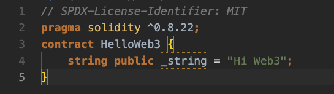
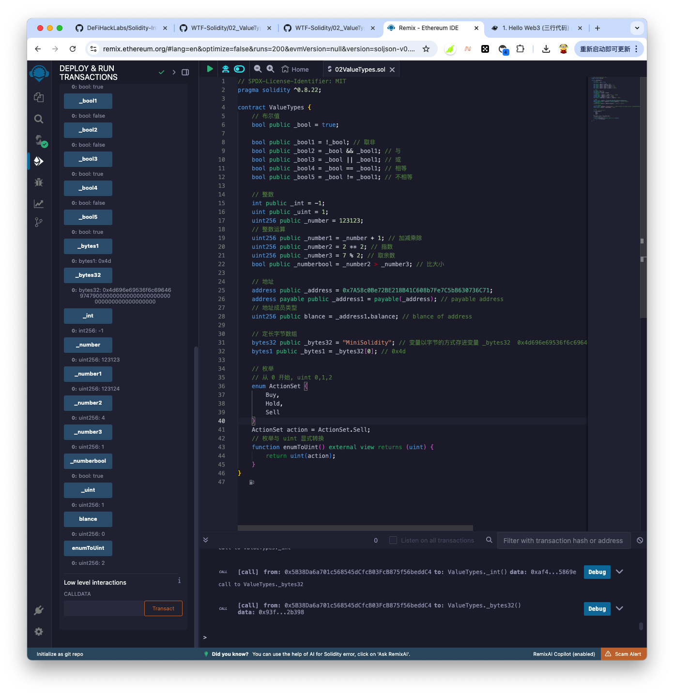
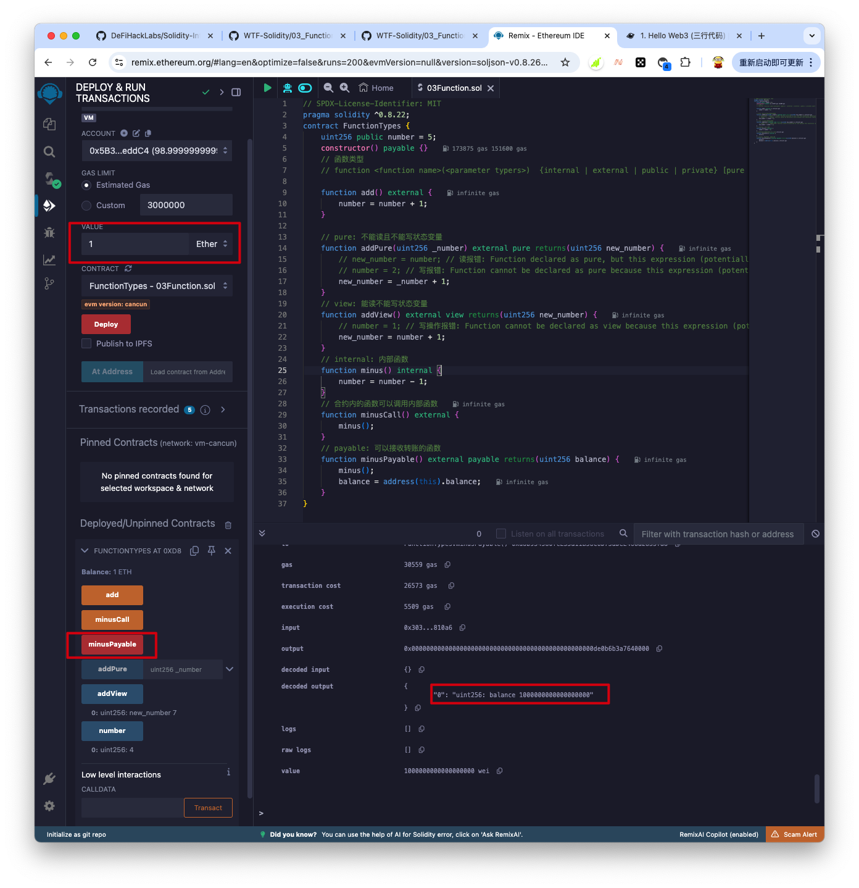
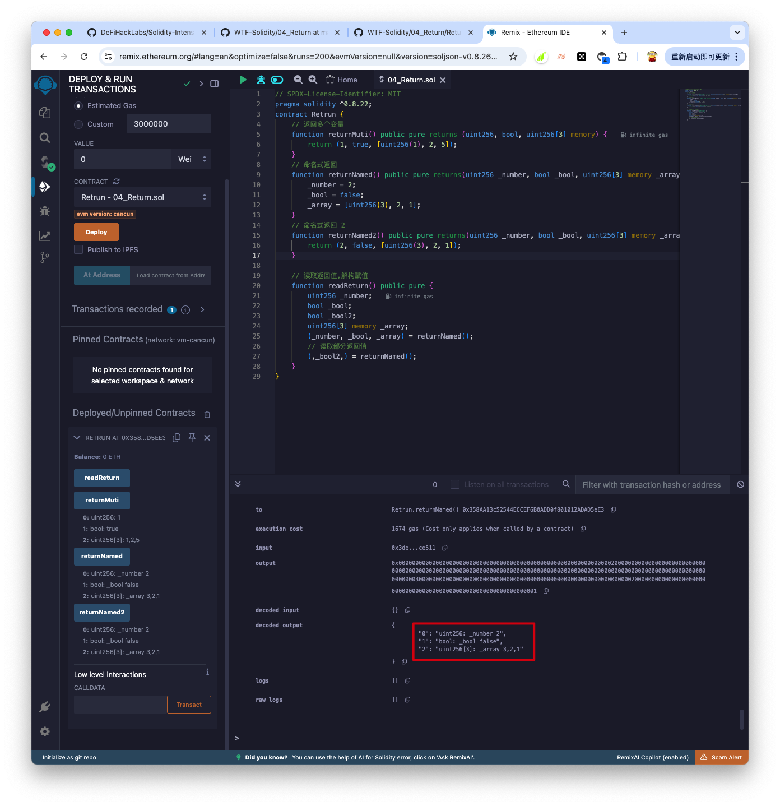

---

# Aris

1. 自我介绍
    - 我是 Aris.

2. 你认为你会完成本次残酷学习吗？
    - 我之前在 `wtf.academy` 学习过相关知识,应该可以完成本次学习.

## Notes

<!-- Content_START -->

### 2024.09.23

#### 学习内容 第01节
 - 01HelloWeb3.sol 创建 helloWeb3 程序,并在 remix 上进行编译和部署

 - 代码部分

- 

 - 在根目录创建 contracts 目录,创建 .sol 文件,放入上面代码

 - 使用 nodejs 安装 remixd

 - ```
    npm install -g @remix-project/remixd

 - node 安装
   - 下载地址: https://nodejs.org/en/download/prebuilt-installer/current
   - 查看 node 仓库源 `npm config  get registry`
   - 修改 node 仓库源 `npm config set registry https://registry.npmmirror.com`

 - 创建脚本`remix.sh`, 让 `https://remix.ethereum.org` 网站能关联本地文档

 - ```
    DIR=$(cd "$(dirname "$0")"; pwd)
    contracts=${DIR}/contracts
    echo '合约地址:' ${contracts} 
    remixd -s ${contracts} --remix-ide https://remix.ethereum.org
    ```

 - 执行remix.sh

 - ```
    ./remix.sh

 - 编译和部署
   - 使用Google Chrome打开`https://remix.ethereum.org`,左侧 workspace 中选择 `connect to localhost`
   - 然后点击 `connect` 按钮,就会加载出本地 `contracts`目录下的 .sol 文件
   - 点击 `01HelloWeb3.sol`进入文件,然后 `cmd + s`, 会进行编译
   - 点击左侧 `deploy & run transactions` 按钮,点击 `高亮`的 Depoly 按钮
   - 左侧会出现部署结果,点击 `_string` 出现 `'Hi Web3'`,表示成功.

- 也可以在 https://remix.ethereum.org 直接编写代码,然后编译和部署,但是我习惯在本地编写代码^_^

- 第01节测验得分: 100, 答案: BBABCCBA

    ---

### 2024.09.24

#### 学习内容 第02 节: 值类型 第03节:函数类型

- 第02 节: 值类型
  - 值类型: Value Type 
  - 引用类型: Reference Type
  - 映射类型: Mapping Type
  
- 值类型:
  - 布尔型
    - 与`&&`,或`||`,非`!` 等于`=`,不等于`!=`
    - `&&` 和` ||` 遵循短路规则
  - 整形
    - `int`整数, `uint` 正整数, `uint256` 256位正整数
    - 比较运算符: <=, <, >=, >, ==, !=
    - 算数运算符: `+`,` -` , `*` ,`/`, `%`, `**`
  - 地址类型
    - 普通地址: address, 存储一个 20 字节的值(以太坊)
    - payable address: 用于接收转账,有 transfer 和 send 方法
  - 定长字节数组
    - 定长字节数组时值类型,数组长度在声明以后不能改变,分为 bytes1,bytes8,bytes32等,最大bytes 32
  - 枚举 enum
    - 为uint 分配名称,从 0 开始.
  
- 合约部署截图

- 

- 第节: 函数类型

- `function <function name>(<parameter types>) {internal|external|public|private} [pure|view|payable] [returns (<return types>)]`
  - function: 函数声明的固定写法
  - name: 函数名
  - 函数可见性修饰符 (必须指定)
    - public: 内部: 可以, 外部: 可以, 继承: 可以
    - private: 内部: 可以, 外部: 不可以, 继承: 不可以
    - external: 内部: 不可以(通过 `this.f()`调用), 外部: 可以, 继承: 可以
    - internal: 内部: 可以, 外部: 不可以, 继承: 可以
  - 权限关键字
    - pure: 外部变量,不能读,不能写 | 无 gas 消耗 | 注意: 调用任何非标记 pure/view 函数需要支付 gas 费
    - view: 外部变量,能读,不能写 | 无 gas 消耗 | 注意: 调用任何非标记 pure/view 函数需要支付 gas 费
    - payable: 调用函数可以转入 ETH (下面截图中,调用`minusPayable()` 传入了1 个 ETH,合约余额就受到了 1ETH)
  - retuns: 函数返回的变量类型和名称
  
- 合约部署截图

- 

- 第 02 节测验得分 100,答案:C,D,C,B,D

- 第 03 节测验得分 100,答案:

  ---

### 2024.09.25

#### 学习内容 第 04 节:4. 函数输出

1. 返回值: return 和 returns
    - return:函数主体,返回指定变量
    - returns:函数名后面,声明返回的变量类型及变量名

2. 命名式返回
    - 在 returns 中标明返回变量的名称
    - solidity 会初始化这些变量,并且自动返回这些函数的值,无需 return.
    - 也可以在命名式返回中用 retrun 来返回变量

3. 解构赋值
    - 读取所有返回值:声明变量,在`()`中按顺序逗号隔开
    - 读取部分返回值:声明要读取的变量,按顺序,不读的空着.

4. 合约部署
    - 

5. 第 04 节测验得分:100, 答案: ABCBABCB

    ---

### 2024.09.26

#### 学习内容 第 05 节: 5. 变量数据存储和作用域 storage/memory/calldata

1. solidity 中的引用类型
2. 数据位置
3. 变量作用域
4. 合约部署
5. 第 05 节测验得分: 100, 答案: DBACDABA

<!-- Content_END -->
